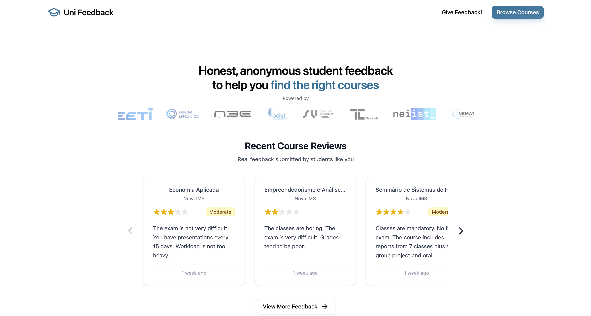

# Uni Feedback

## Honest reviews. Smarter choices.

**Uni Feedback** is a platform where you can discover what each course is really like, through honest, anonymous reviews from fellow students.

- **Know what to expect before enrolling** — avoid bad courses, find the best ones for you.
- **Share your own experience** — help other students make informed decisions. Your review is always anonymous.

👉 [Explore course ratings and reviews](https://uni-feedback.com)



---

❤️ **Finding this platform useful?**

[Give your anonymous review](https://uni-feedback.com/feedback/new) on the courses you took. Other students will thank you!

## Development Setup

This is a **Turborepo monorepo** with React frontends and a Cloudflare Workers backend.

### Prerequisites

- **Bun** (latest version)
- **Node.js** 18+
- **Git**

### Quick Start

1. **Clone and install dependencies:**
   ```bash
   git clone https://github.com/afonsocrg/MEIC-feedback.git
   cd MEIC-feedback
   bun install
   ```

2. **Set up the shared database:**
   ```bash
   # This script configures both apps to use the same local D1 database
   ./setup-database.sh
   ```

3. **Start all development servers:**
   ```bash
   bun run dev
   ```

This will start:
- **Main website** at http://localhost:5173
- **Admin dashboard** at http://localhost:5174  
- **API** at http://localhost:8787
- **SSG website** at http://localhost:5175 (if running)

### Important: Shared Database Setup

Both the API and SSG website apps share the **same local D1 database instance**. This is critical for data consistency between server-side rendering and API responses.

The `setup-database.sh` script creates symbolic links so both apps use:
- **Same database location:** `packages/database/.wrangler/`
- **Same schema and migrations:** `packages/database/src/schema/`
- **Same data:** Changes in one app are immediately visible in the other

### Project Structure

```
uni-feedback/
├── apps/
│   ├── website/           # Main React website (port 5173)
│   ├── dashboard/         # Admin dashboard (port 5174)
│   ├── api/              # Cloudflare Workers API (port 8787)
│   └── ssg-website/      # SSG React Router app (port 5175)
├── packages/
│   ├── database/         # 🗄️ Shared database (schema, migrations)
│   ├── ui/              # Shared UI components
│   └── utils/           # Shared utilities
└── setup-database.sh    # Database configuration script
```

### Available Commands

```bash
# Monorepo commands (run from root)
bun run dev              # Start all development servers
bun run build            # Build all applications
bun run format           # Format code (run before commits!)
bun run lint             # Lint all packages
bun run type-check       # Type check all packages

# Database commands (run from packages/database/)
bun run db:generate      # Generate migrations
bun run db:migrate       # Apply migrations locally
bun run db:studio        # Open Drizzle Studio
bun run db:backup        # Backup database (local + remote)
```

### Tech Stack

- **Frontend:** React 19, TypeScript, Vite, TailwindCSS 4.x, shadcn/ui
- **Backend:** Cloudflare Workers, Drizzle ORM
- **Database:** Cloudflare D1 (SQLite)
- **Monorepo:** Turborepo with Bun workspaces
- **State Management:** TanStack Query

## Contributing

The sole purpose of this project is to help students choosing the right courses for them.
If you find any bug or there's a feature you'd like to see, feel free to open an [issue](https://github.com/afonsocrg/MEIC-feedback/issues) or a [PR](https://github.com/afonsocrg/MEIC-feedback/pulls)!
