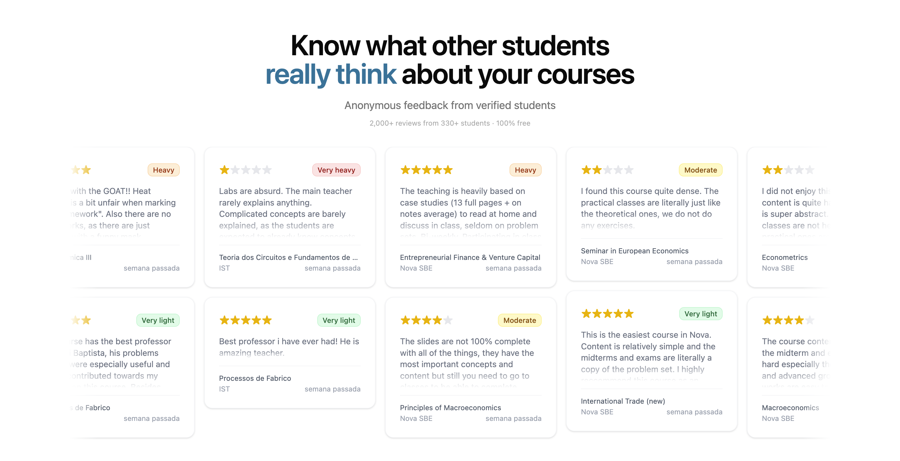

# Uni Feedback

## Honest reviews. Smarter choices.

**Uni Feedback** is a platform where you can discover what each course is really like, through honest, anonymous reviews from fellow students.

- **Know what to expect before enrolling** — avoid bad courses, find the best ones for you.
- **Share your own experience** — help other students make informed decisions. Your review is always anonymous.

👉 [Explore course ratings and reviews](https://uni-feedback.com)



---

❤️ **Finding this platform useful?**

[Give your anonymous review](https://uni-feedback.com/feedback/new) on the courses you took. Other students will thank you!

## Development Setup

This is a **Turborepo monorepo** with a React Router 7 (SSR) frontend, an Express backend, and a PostgreSQL database.

### Prerequisites

- **Node.js** 22+
- **pnpm** 9.15.4+
- **Docker** (for the local database)

### Quick Start

1. **Clone and install dependencies:**
   ```bash
   git clone https://github.com/afonsocrg/MEIC-feedback.git
   cd MEIC-feedback
   pnpm install
   ```

2. **Configure environment variables:**
   ```bash
   cp .env.example .env
   cp apps/api/.env.example apps/api/.env
   cp apps/website-ssr/.env.example apps/website-ssr/.env
   # Update DATABASE_URL and PGPASSWORD in each .env file
   ```

3. **Start the database:**

   `docker-compose.yml` defines the full stack (db + api + website-ssr), but for local development you only need the database — the apps run natively via pnpm:
   ```bash
   docker compose up db -d
   ```

4. **Run database migrations:**
   ```bash
   cd packages/db
   pnpm migrate
   cd ../..
   ```

5. **Start all development servers:**
   ```bash
   pnpm dev
   ```

This will start:
- **Main website** at http://localhost:3000
- **Admin dashboard** at http://localhost:5174
- **API** at http://localhost:3001

### Project Structure

```
uni-feedback/
├── apps/
│   ├── website-ssr/       # Main student-facing website (React Router 7 + SSR)
│   ├── dashboard/         # Admin dashboard
│   └── api/               # Express backend
├── packages/
│   ├── db/                # Database schema, migrations, Drizzle config
│   ├── ui/                # Shared UI components
│   ├── api-client/        # Shared API client functions
│   └── utils/             # Shared utility functions
└── docker-compose.yml     # Local database (PostgreSQL)
```

### Available Commands

```bash
# Monorepo commands (run from root)
pnpm dev             # Start all development servers
pnpm build           # Build all applications
pnpm format          # Format code (run before commits!)
pnpm lint            # Lint all packages
pnpm type-check      # Type check all packages

# Database commands (run from packages/db/)
pnpm generate        # Generate a new migration
pnpm migrate         # Apply pending migrations
pnpm studio          # Open Drizzle Studio
```

### Tech Stack

- **Frontend:** React 19, React Router 7, TypeScript, Vite, TailwindCSS 4.x, shadcn/ui
- **Backend:** Node.js, Express, Drizzle ORM
- **Database:** PostgreSQL (via Docker locally)
- **Monorepo:** Turborepo with pnpm workspaces
- **State Management:** TanStack Query

### Git Hooks

The pre-commit hook auto-formats staged files. Set it up once after cloning:

```bash
ln -sf ../../ops/pre-commit.sh .git/hooks/pre-commit
```

## Production

In production (and staging), the full stack — database, API, and website — runs inside Docker containers. Images are built by GitHub Actions and pushed to GHCR; the server pulls and runs them via `docker-compose.prod.yml` (or `docker-compose.staging.yml` for staging).

## Contributing

The sole purpose of this project is to help students choosing the right courses for them.
If you find any bug or there's a feature you'd like to see, feel free to open an [issue](https://github.com/afonsocrg/MEIC-feedback/issues) or a [PR](https://github.com/afonsocrg/MEIC-feedback/pulls)!
